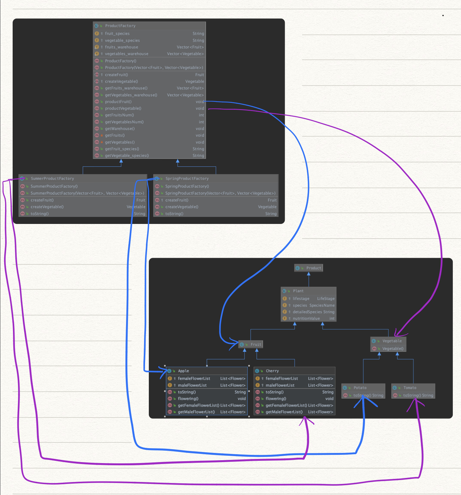

## 3.3 Abstract Factory

### 设计模式简述

​	桥接模式即以同一界面创建一整族相关或相依的objects，不需点名各对象真正所属的具体类。为访问类提供一个创建一组相关或相互依赖对象的接口，且访问类无须指定所要产品的具体类就能得到同族的不同等级的产品的模式结构。

**使用抽象工厂的条件：**

- 系统中有多个产品族，每个具体工厂创建同一族但属于不同等级结构的产品。
- 系统一次只可能消费其中某一族产品，即同族的产品一起使用。

**优点：**

- 可以在类的内部对产品族中相关联的多等级产品共同管理，而不必专门引入多个新的类来进行管理。
- 当增加一个新的产品族时不需要修改原代码，满足开闭原则。

### 3.3.1 ProductFactory实现API

#### 3.3.1.1 API 描述

​	从逻辑上来讲，春季工厂和夏季工厂都生产蔬菜和水果，只是二者种植的蔬菜和水果种类不同，将他们共同的特点——产品工厂抽象成父类，并在父类中将生产的蔬菜和水果也抽象化。如此一来，可以在具体的产品工厂中指定要生产的蔬菜及水果种类，同时用户可以方便的切换工厂，以生产不同种类的产品。

​	在该API中，为抽象工厂添加蔬菜仓库和水果仓库，将具体工厂生产的响应产品加入到仓库中，方便管理、并易于用户进行操作（如售卖、食用、种植等）。用户可以动态的更改所选的工厂，如果选择的工厂与之前相同，则继续生产该工厂的产品，并加入之前到仓库中；如果用户更换仓库，则生产不同的产品，并把原工厂生产的产品移动到现在的工厂中，从用户角度看，蔬菜仓库和水果仓库存储的是各个季节的蔬菜水果，既与真实场景相同，又便于管理和用户操作。

​	该API满足开放闭守原则，如果天天农场打算在秋天额外种植柚子和白菜，只需构建`AutumnProductFactory`，在工厂中种植`Grapefruit`和`Cabbage`，并由用户自己选择秋季工厂，不需要修改工厂的内部实现也不需要增加额外的接口，并且一切选择权交由用户自己决定。

| 函数名                                                       | 作用                                                         |
| ------------------------------------------------------------ | ------------------------------------------------------------ |
| void productFruit()                                          | 作为抽象工厂的接口函数。ProductFactory基类中的方法，开放给用户的接口，内部首先创建水果，之后加入水果仓库中，具体的水果在具体的产品工厂中提供。 |
| void productVegetable()                                      | 作为抽象工厂的接口函数。ProductFactory基类中的方法，开放给用户的接口，内部首先创建蔬菜，之后加入蔬菜仓库中，具体的蔬菜在具体的产品工厂中提供。 |
| ProductFactory(Vector<Fruit> store_fruits_warehouse, Vector<Vegetable> store_vegetables_warehouse) | 用户动态更改工厂时调用，将之前产品工厂中生产的产品移动到新工厂中。由于抽象工厂模式的特性，产品使用抽象类实现，因此不同种类的水果可以放到同一个水果仓库中，蔬菜同理。 |
| void SwitchProductFactory(FactoryKind opcode)                | 用户动态更改产品工厂的选择 如果工厂之前是空的，则初始化一个新工厂  如果工厂之前生产的是其他东西，把之前的产品保存  如果工厂之前生产的就是当前的东西，则直接return |

#### 3.3.1.2 类图

#### 3.3.1.3 流程图（可选项，类图比较简单的可以画一下）

#### 3.3.1.4 时序图（可选项，类图比较简单的可以画一下）