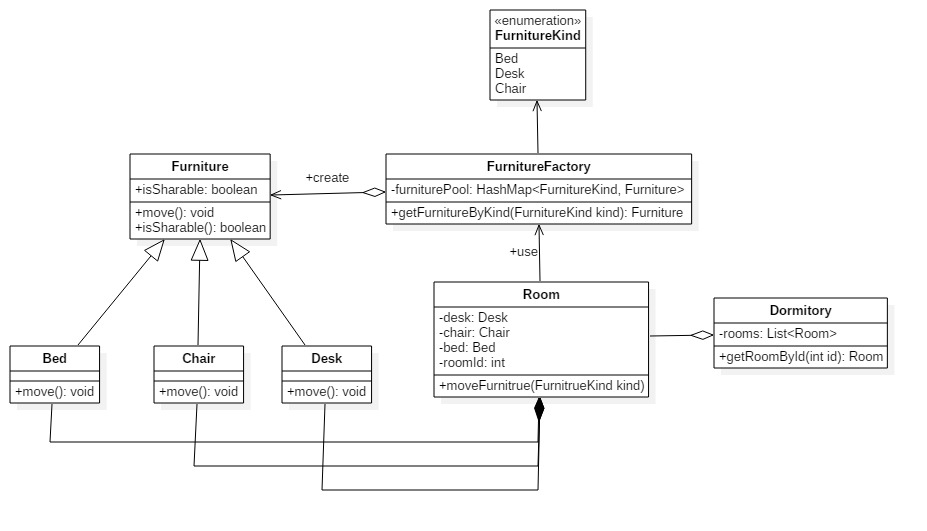

## 3.11 Copy On Write

### 设计模式简述

​	写入时复制（Copy-on-write，简称COW）是一种计算机程序设计领域的优化策略。其核心思想是，如果有多个调用者同时请求相同资源（如内存或磁盘上的数据存储），他们会共同获取相同的指针指向相同的资源，直到某个调用者试图修改资源的内容时，系统才会真正复制一份专用副本给该调用者，而其他调用者所见到的最初的资源仍然保持不变。这过程对其他的调用者都是透明的。

### 3.10.1 COW模式实现API

#### 3.10.1.1 API 描述

​	对一栋宿舍楼来说，它有很多宿舍，每间宿舍里都有床、桌子、椅子等家具。如果在新建一栋宿舍楼时为每间宿舍都创建一套床、桌子、椅子的对象，则会很耗时。考虑到在这些家具在没有被修改之前，所有的宿舍都可以共享一套家具对象（这里的共享并不是说所有的宿舍共用一套家具，而是说共享家具对象）。我们使用工厂类FurnitureFactory 来维护共享逻辑，具体是在工厂类中维护一个关于家具对象的 HashMap 类型furniturePool作为家具池，每当需要的家具对象已经在家具池中时，便可以直接返回，否则创建新的家具对象并将其加入furniturePool中。每当某间宿舍的家具对象需要修改时，提前为该宿舍创建一个副本然后修改。这样以来，可以大大加快新建一栋宿舍的速度，并且如果家具对象没有被修改，就不会有副本被建立，因此多个宿舍只是读取操作时可以共享同一套家具对象。

| 函数名                                           | 作用                                                         |
| ------------------------------------------------ | ------------------------------------------------------------ |
| Furniture createFurniture(FurnitureKind kind)    | 根据给定的家具类型创建家具对象                               |
| Furniture getFurnitureByKind(FurnitureKind kind) | 当给定的家具类型的对象在furniturePool中已经存在时直接返回，否则新创建该类型的家具对象并将其加入到furniturePool中。 |

#### 3.10.1.2 类图

#### 3.3.1.3 流程图（可选项，类图比较简单的可以画一下）

#### 3.3.1.4 时序图（可选项，类图比较简单的可以画一下）