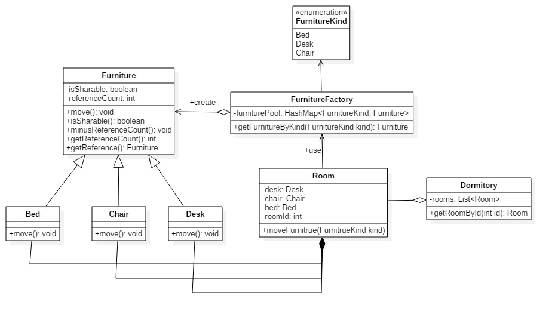

## 3.11 Copy On Write、Reference Counting、Sharable

### 设计模式简述

​	写入时复制（Copy-on-write，简称COW）是一种计算机程序设计领域的优化策略。其核心思想是，如果有多个调用者同时请求相同资源（如内存或磁盘上的数据存储），他们会共同获取相同的指针指向相同的资源，直到某个调用者试图修改资源的内容时，系统才会真正复制一份专用副本给该调用者，而其他调用者所见到的最初的资源仍然保持不变。这过程对其他的调用者都是透明的。

   引用计数(Reference Counting)是计算机编程语言中的一种内存管理技术，是指将资源（可以是对象、内存或磁盘空间等等）的被引用次数保存起来，当被引用次数变为零时就将其释放的过程。使用引用计数技术可以实现自动资源管理的目的。

  共享(Sharable)用于防止COW过程中重复创建备份。

### 3.10.1 COW模式实现API

#### 3.10.1.1 API 描述

​	对一栋宿舍楼来说，它有很多宿舍，每间宿舍里都有床、桌子、椅子等家具。如果在新建一栋宿舍楼时为每间宿舍都创建一套床、桌子、椅子的对象，则会很耗时。考虑到在这些家具在没有被修改之前，所有的宿舍都可以共享一套家具对象（这里的共享并不是说所有的宿舍共用一套家具，而是说共享家具对象）。我们使用工厂类FurnitureFactory 来维护共享逻辑，具体是在工厂类中维护一个关于家具对象的 HashMap 类型furniturePool作为家具池，每当需要的家具对象已经在家具池中时，便可以直接返回，否则创建新的家具对象并将其加入furniturePool中。每当某间宿舍的家具对象需要修改时，提前为该宿舍创建一个副本然后修改。这样以来，可以大大加快新建一栋宿舍的速度，并且如果家具对象没有被修改，就不会有副本被建立，因此多个宿舍只是读取操作时可以共享同一套家具对象。

​	一个家具对象在新创建后的引用计数为0，每当调用getReference函数时引用计数加一，每当创建备份时原家具对象的引用计数减一。（这里我们假定只有调用家具对象的getReference函数才能进行赋值操作）。

​	一个家具在创建时是可共享的，在被其他宿舍共享的过程中也是可共享的。不过新建的备份是不可共享的，不然的话每次修改家具对象（移动位置）都要重新创建一个新的备份。

| 函数名                                           | 作用                                                         | 类               |
| ------------------------------------------------ | ------------------------------------------------------------ | ---------------- |
| Furniture createFurniture(FurnitureKind kind)    | 根据给定的家具类型创建家具对象                               | FurnitureFactory |
| Furniture getFurnitureByKind(FurnitureKind kind) | 当给定的家具类型的对象在furniturePool中已经存在时直接返回，否则新创建该类型的家具对象并将其加入到furniturePool中。 | FurnitureFactory |
| getReference()                                   | 返回家具对象的引用，并将其引用计数加一                       | Furniture        |
| minusReferenceCount()                            | 当家具对象被创建了一个备份后，引用计数减一                   | Furniture        |
| moveFurniture(FurnitureKind kind)                | 移动宿舍的家具(修改家具对象), 如果家具对象可共享则创建备份，否则不创建。 | Room             |

#### 3.10.1.2 类图

#### 3.3.1.3 流程图（可选项，类图比较简单的可以画一下）

#### 3.3.1.4 时序图（可选项，类图比较简单的可以画一下）