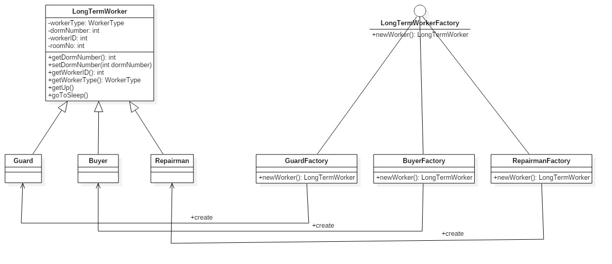

## 3.10 Factory Method, Virtual Constructor

### 设计模式简述

​	工厂方法模式，又称工厂模式、多态工厂模式和虚拟构造器模式，通过定义工厂父类负责定义创建对象的公共接口，而子类则负责生成具体的对象。

### 3.10.1 工厂模式实现API

#### 3.10.1.1 API 描述

​	农场中有很多种类的长工，他们需要不同的工厂去创造示例。这里我们用 LongTermWorkerFactory 工厂父类定义创建 LongTermWorker 的抽象方法，然后定义长工的基类LongTermWorker。这样，每当需要用工厂方法创建一个新的种类的长工，只需定义LongTermWorker的子类，然后定义工厂父类的子类去实例化新添加的长工对象。具体的长工工厂类和其能创建的长工类是一一对应的。如此一来便克服了简单工厂模式违背OCP原则的缺点，而保留了封装对象创建过程的优点,降低客户端和工厂的耦合性。

| 函数名                     | 作用                                                         |
| -------------------------- | ------------------------------------------------------------ |
| LongTermWorker newWorker() | 工厂父类的抽象方法，具体实现由创建具体LongTermWorker对象的具体工厂子类决定。 |

（所设计的函数名及其作用的表格）

#### 3.10.1.2 类图

#### 3.3.1.3 流程图（可选项，类图比较简单的可以画一下）

#### 3.3.1.4 时序图（可选项，类图比较简单的可以画一下） 