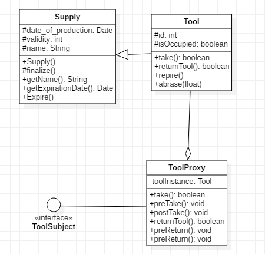

## 3.18 Proxy

### 设计模式简述

由于某些原因需要给某对象提供一个代理以控制对该对象的访问。这时，访问对象不适合或者不能直接引用目标对象，代理对象作为访问对象和目标对象之间的中介。 代理模式的结构比较简单，主要是通过定义一个继承抽象主题的代理来包含真实主题，从而实现对真实主题的访问。 

### 3.18.1 Tool状态实现API

#### 3.18.1.1 API描述

为tool的借用做一个代理，工人们通过与代理的交互进行工具的获取与归还。

1.  抽象主题（Subject）类：通过接口实现tool的取用和归还两个功能 
2.  真实主题（Real Subject）类：即tool类本身
3.  代理（Proxy）类：提供了和tool本身相同的方法，有所扩展

| 函数名               | 作用               |
| -------------------- | ------------------ |
| boolean take()       | 取用该工具         |
| boolean returnTool() | 归还该工具         |
| void preTake()       | 取用工具的前置处理 |
| void preReturn()     | 归还工具的前置处理 |
| void postTake()      | 取用工具的后置处理 |
| void PostReturn()    | 归还工具的后置处理 |

#### 3.20.1.2 类图

