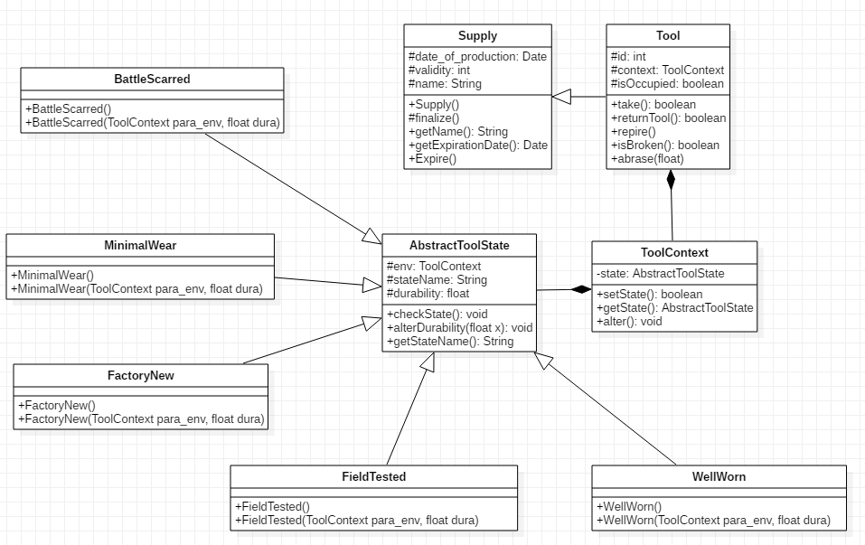

## 3.20 State, Objects for States

### 设计模式简述

对有状态的对象，把复杂的“判断逻辑”提取到不同的状态对象中，允许状态对象在其内部状态发生改变时改变其行为。状态模式的解决思想是：当控制一个对象状态转换的条件表达式过于复杂时，把相关“判断逻辑”提取出来，放到一系列的状态类当中，这样可以把原来复杂的逻辑判断简单化。  

### 3.20.1 Tool状态实现API

#### 3.20.1.1 API描述

Tool有根据不同的磨损程度(durability)拥有不同的状态(崭新出厂，略有磨损，久经沙场，破损不堪，战痕累累)，状态的下降会影响其使用效率。

1.  环境（Context）角色：定义一个环境类来描述tool的状态
2.  抽象状态（State）角色：定义一个接口，用以封装环境对象中的特定状态所对应的行为。
3.  具体状态（Concrete  State）角色：实现抽象状态所对应的行为。

| 函数名                              | 作用                                                 |
| ----------------------------------- | ---------------------------------------------------- |
| void setState()                     | 为该工具环境设置状态                                 |
| void alter(float val)               | 改变该工具环境的状态的耐久度                         |
| void checkState()                   | 根据该状态的耐久度更改其绑定的环境的状态             |
| ToolContext()                       | 工具环境的构造函数                                   |
| FactoryNew(ToolContext para_env)    | 具体状态（崭新出厂）的构造函数，绑定环境实例para_env |
| MinimalWear(ToolContext para_env)   | 具体状态（略有磨损）的构造函数，绑定环境实例para_env |
| FieldTested(ToolContext para_env)   | 具体状态（久经沙场）的构造函数，绑定环境实例para_env |
| WellWorn(ToolContext para_env)      | 具体状态（破损不堪）的构造函数，绑定环境实例para_env |
| BattleScarred(ToolContext para_env) | 具体状态（战痕累累）的构造函数，绑定环境实例para_env |

#### 3.20.1.2 类图

