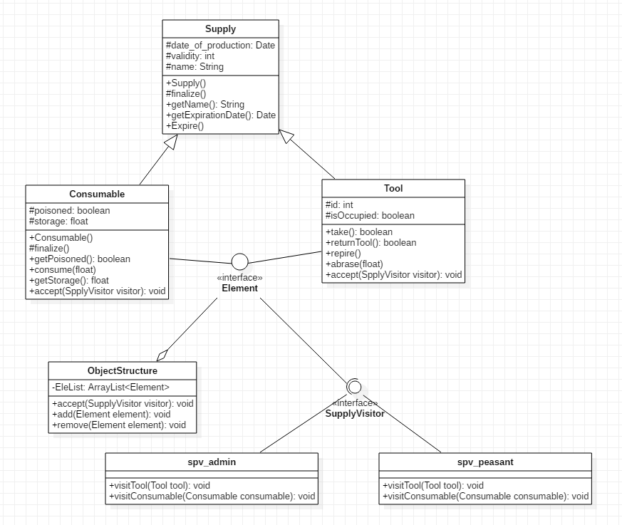

## 3.23 Proxy

### 设计模式简述

将作用于某种数据结构中的各元素的操作分离出来封装成独立的类，使其在不改变数据结构的前提下可以添加作用于这些元素的新的操作，为数据结构中的每个元素提供多种访问方式。它将对数据的操作与数据结构进行分离，是行为类模式中最复杂的一种模式。

### 3.23.1 Tool状态实现API

#### 3.23.1.1 API描述

当农夫访问supply时，他们使用消耗品和工具来进行各种耕种活动，他们主要关心对象能否被使用；当管理人员访问supply时，他们关心对象消耗品的量或者是否变质过期，以及工具的耐久度；对Consumable和Tool两个类，不同的人员处理方式不同，故该实例用访问者模式来实现比较合适。

1.  抽象访问者（Visitor）角色：农场人员
2.  具体访问者（ConcreteVisitor）角色：具体的农夫、管理者、工人等等
3.  抽象元素（Element）角色：声明一个包含接受操作 accept() 的接口，被接受的访问者对象作为 accept() 方法的参数。
4.  具体元素（ConcreteElement）角色：实现抽象元素角色提供的 accept() 操作，其方法体通常都是 visitor.visit(this) ，另外具体元素中可能还包含本身业务逻辑的相关操作。
5.  对象结构（Object Structure）角色：是一个包含元素角色的容器，提供让访问者对象遍历容器中的所有元素的方法，通常由 List、Set、Map 等聚合类实现。

| 函数名                        | 作用                                                         |
| ----------------------------- | ------------------------------------------------------------ |
| void Element.accept()         | Element接受某Visitor访问时调用，被Tool和Consumable重载       |
| void ObjectStructure.accept() | 某Visitor遍历访问对象结构中的所有Element                     |
| void add()                    | 向对象结构中加入Element                                      |
| void remove()                 | 在对象结构中删除某个指定Element                              |
| void visitTool()              | 被管理员visitor和农民visitor重载，在Tool.accept()中调用      |
| void visitConsumable()        | 被管理员visitor和农民visitor重载，在Consumable.accept()中调用 |

#### 3.23.1.2 类图

